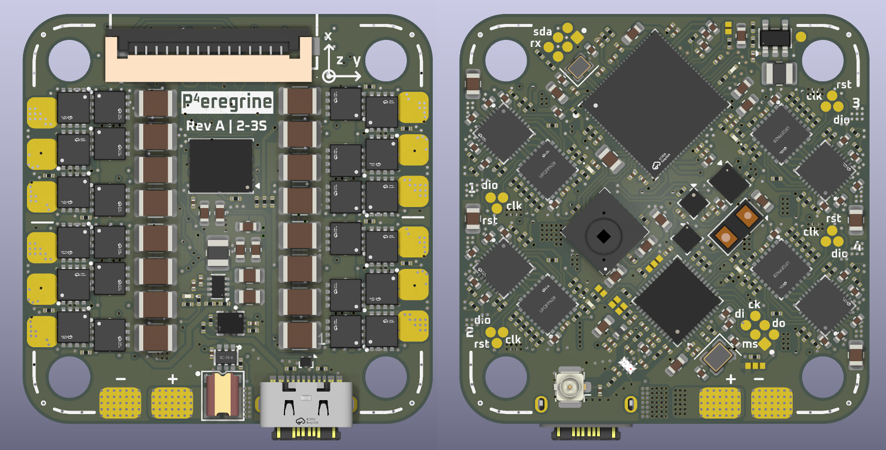

# P4eregrine
An all-in-one drone ESC, flight controller and video processor, powered by an ESP32 P4 in a 40x40 mm footprint.

### Specifications
- 2S-3S (7-13 V) battery input
- 40x40 mm board size
- ESP32 P4 flight computer and video processor
- ESP32 C5 for 2.4 GHz and 5 GHz Wi-Fi connectivity
- Raspberry Pi camera-compatible connector (MIPI-CSI)
- LSM6DSR IMU, LIS2MDL magnetometer, LPS22HB barometer, VL53L1X time of flight sensor, PMW3901MB optical flow sensor
- STM32G071GBU6 + DRV8328 for each ESC running AM32, hopefully capable of handling 15 A current per motor
- JMSL0302AU MOSFETs (the cheapest semi-reputable 3x3 package I could find with a lower than 3 mOhm RDS(on) when hot)
- TPS62933 buck converter for 3.3V power, capable of continuously supplying ~2.3 A
- Single high-side current measurement shunt for the entire board

### Stackup
6 layers, 1oz outer copper, 0.5 oz inner copper, 1.2 mm thick (JLC06121H-3313)
- L1: Mixed
- L2: GND
- L3: 3V3 plane + some signals
- L4: BAT plane + some signals
- L5: GND
- L6: Mixed

Filled and capped vias are a must, as the board makes extensive use of via-in-pad. All vias are 0.45/0.25 mm or bigger to avoid incurring extra fees from JLCPCB.

Schematics, layer images and BOM are available in `docs/`